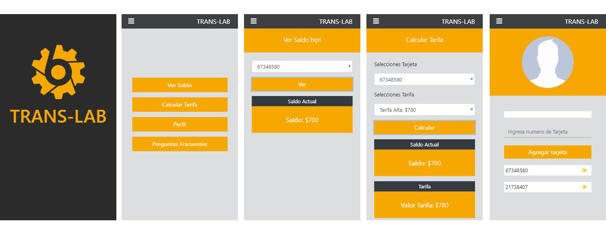

TransLab es una aplicación mobile para consultar saldo de tarjeta bip y calcular tarifa según el horario.

## Tecnología usada

* HTML5
* CSS3
* Javascript ECMA6
* Bootstrap
* Firestore database

## Vistas

### versión mobile

## Instrucciones de uso

* Ingrese a la aplicación **Trans-Lab**.

* En **Perfil** puede ingresar el numero de tarjeta.

* En **Ver Saldo** selección entre los numero de tarjeta ya ingresados y consultar saldo actuál.

* En **Calcular tarifa** seleccióne elección entre los numero de tarjeta ya ingresados y calcule su saldo según el horario elegido.

## Enlace Deploy

https://valepm0511.github.io/TransLab/

